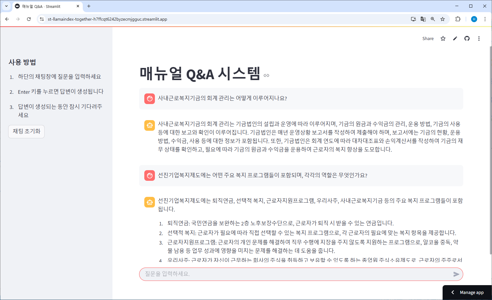

# st-llamaindex-together

LlamaIndex와 Together AI, Hugging Face를 활용한 Streamlit 문서 검색 애플리케이션입니다.

https://st-llamaindex-together-h7ffcqt6242byzecmjgguc.streamlit.app

## 소개
이 프로젝트는 LlamaIndex를 사용하여 문서를 벡터화하고, Together AI의 LLM을 활용하여 사용자 질문에 대한 답변을 생성하는 Streamlit 웹 애플리케이션입니다.

## 주요 기능
- 문서 업로드 및 벡터 인덱싱
- 자연어 질의응답
- Together AI의 LLM을 활용한 정확한 답변 생성

## 기술 스택
- Streamlit
- LlamaIndex
- Together AI
- Hugging Face

## 라이선스
MIT License

## 기여하기
이슈와 풀 리퀘스트를 환영합니다!